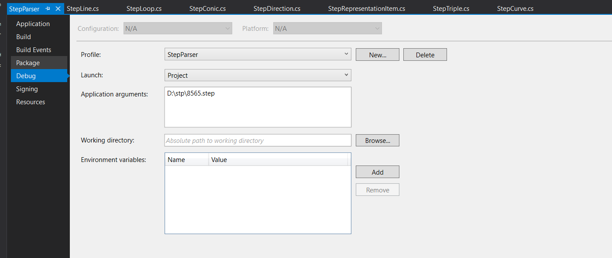

# step-parser

## 1. Code Structure
Totally, it has 3 parts
- Loading file and parsing syntax
- Bind syntax with proper item
- Write XML with loop all items


### Items
`Itmes` includes item classes

For example, `PRODUCT_DEFINITION`, `CLOSED_SHELL` etc

`StepReader` and `StepBinder` is reading stp file and create proper class from item classes
### Syntax

`Syntax` includes utility for handling syntax

For example, `.F.` This is boolean type and it's value is `false`

And also `(#1, #234, #22)` This is array type

### Tokens
`Tokens` includes utility for parsing stp file
```
#208=AXIS2_PLACEMENT_3D('',#381,#382,#383);
```
`#` - Beginning hash
`208` -  Id
`AXIS2_PLACEMENT_3D` - Entity Name (will be matched with item class in Items)
the values are in bracket it attributes

Token classes will be parsing above information

## 2. How to install on local and execute

1. Install Visual Studio
2. Open `StepPraser.sln`
3. It will install Nuget Package automatically. It's C# console application based on Net.2.2 so VS will loading `MicroSoft.NetCore.App (2.2.0)
4. Go to Project Setting and put argument manually

5. Click Debug for executing Current application

## 3. How to build

It's using NetCore 2.2 so it's useful to build with command line

```
dotnet publish -c Debug -r win10-x64
```
